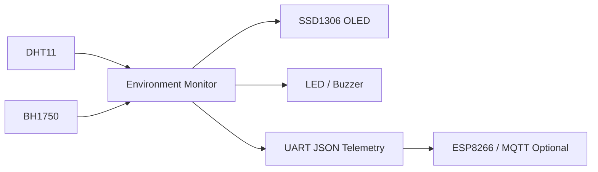

# Smart Environment Monitor

基于 **STM32F103C8T6** 的智能环境监测系统，面向嵌入式学习、课程设计和个人作品集展示。项目采用模块化软件架构，完成温湿度、光照数据采集、OLED 显示、阈值报警、串口遥测及可选的 ESP8266/MQTT 扩展。

> GitHub Description  
> `An STM32-based smart environment monitoring system with sensor acquisition, OLED display, threshold alarms and optional wireless telemetry.`

## 功能概览

| 模块 | 功能 | 默认器件 |
|---|---|---|
| 温湿度采集 | 周期性读取环境温度和湿度 | DHT11 |
| 光照采集 | 获取环境光照强度 | BH1750 |
| 本地显示 | 显示实时数据和报警状态 | 0.96" SSD1306 OLED |
| 阈值报警 | 温度、湿度或光照越界时报警 | LED + 有源蜂鸣器 |
| 串口遥测 | 输出 JSON 格式环境数据 | USART1 |
| 参数管理 | 集中配置采样周期与报警阈值 | `include/config.h` |
| 无线扩展 | 上传数据至 MQTT 平台 | ESP8266，可选 |

## 系统架构



软件分为四层：

1. **应用层**：环境数据处理、报警判定和遥测格式化。
2. **设备层**：DHT11、BH1750、SSD1306 等设备驱动。
3. **平台层**：STM32 HAL 或电脑端模拟接口。
4. **硬件层**：GPIO、I²C、UART、定时器等 MCU 外设。

## 仓库结构

```text
smart-environment-monitor/
├── include/                    # 公共配置和数据结构
├── src/
│   ├── app/                    # 业务逻辑
│   └── platform/host/          # 电脑端模拟平台
├── firmware/stm32/             # STM32 HAL 移植模板
├── tests/                      # 单元测试
├── docs/                       # 硬件、架构、协议和简历材料
├── hardware/                   # 原理图与 PCB 文件占位目录
├── images/                     # 实物图与运行截图
├── .github/                    # CI、Issue 和 PR 模板
├── CMakeLists.txt
└── LICENSE
```

## 默认硬件

- STM32F103C8T6 最小系统板
- DHT11 温湿度传感器
- BH1750 光照传感器
- SSD1306 0.96 英寸 OLED
- 有源蜂鸣器
- LED
- USB 转串口模块
- ESP8266（可选）

详细接线见 [docs/hardware.md](docs/hardware.md)。

## 在电脑上运行模拟程序

项目自带电脑端模拟版本，便于在没有开发板时检查业务逻辑。

### Linux / macOS

```bash
cmake -S . -B build
cmake --build build
./build/environment_monitor_sim
ctest --test-dir build --output-on-failure
```

### Windows PowerShell

```powershell
cmake -S . -B build
cmake --build build --config Release
.\build\Release\environment_monitor_sim.exe
ctest --test-dir build -C Release --output-on-failure
```

示例输出：

```json
{"timestamp_ms":1000,"temperature_c":25.4,"humidity_pct":61.0,"light_lux":420.0,"alarm_mask":0}
```

## STM32 移植步骤

1. 使用 STM32CubeMX 创建 STM32F103C8T6 HAL 工程。
2. 配置 USART1、I²C1、DHT11 数据引脚、LED 和蜂鸣器 GPIO。
3. 将 `include/` 和 `src/app/` 加入工程。
4. 根据 `firmware/stm32/` 中的模板实现传感器读取、OLED 显示和时间接口。
5. 在主循环中周期调用应用层接口。
6. 通过串口助手观察 JSON 数据，并验证报警功能。

详细说明见 [firmware/stm32/README.md](firmware/stm32/README.md)。

## 默认参数

配置文件：[include/config.h](include/config.h)

| 参数 | 默认值 |
|---|---:|
| 采样周期 | 1000 ms |
| 温度上限 | 35 °C |
| 湿度上限 | 80 %RH |
| 光照下限 | 50 lux |
| 串口波特率 | 115200 bps |

## 串口数据协议

```json
{
  "timestamp_ms": 1000,
  "temperature_c": 25.4,
  "humidity_pct": 61.0,
  "light_lux": 420.0,
  "alarm_mask": 0
}
```

报警位定义：

| Bit | 含义 |
|---:|---|
| 0 | 温度过高 |
| 1 | 湿度过高 |
| 2 | 光照过低 |
| 3 | 传感器数据无效 |

## 测试

当前自动化测试覆盖：

- 正常环境数据不触发报警
- 温度过高报警
- 多种报警同时触发
- 无效数据检测
- JSON 遥测格式生成

GitHub Actions 会在每次 Push 和 Pull Request 时自动执行编译与测试。

## 后续计划

- [ ] 完成真实 DHT11 驱动
- [ ] 完成 BH1750 I²C 驱动
- [ ] 接入 SSD1306 OLED
- [ ] 增加按键菜单和阈值设置
- [ ] 使用内部 Flash 保存配置
- [ ] 接入 FreeRTOS
- [ ] 增加 ESP8266 + MQTT
- [ ] 制作 KiCad 原理图和 PCB
- [ ] 补充实物照片、演示视频和功耗测试

## 简历描述

> 基于 STM32F103C8T6 设计智能环境监测系统，完成温湿度与光照数据采集、OLED 显示、阈值报警及 UART JSON 遥测；采用分层架构解耦业务逻辑、设备驱动与硬件平台，并通过 CMake、单元测试和 GitHub Actions 验证核心逻辑。

更完整版本见 [docs/resume-description.md](docs/resume-description.md)。

## License

本项目采用 [MIT License](LICENSE)。
